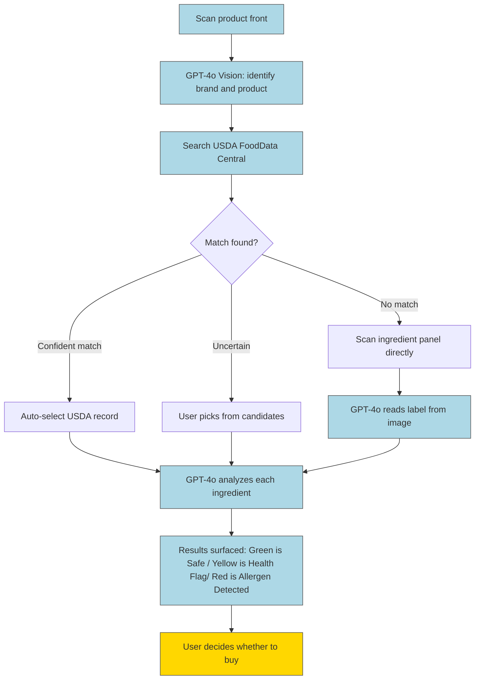
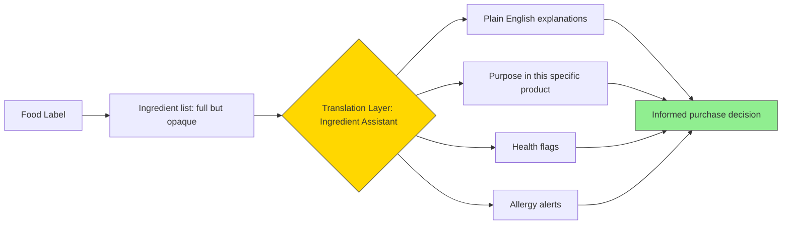
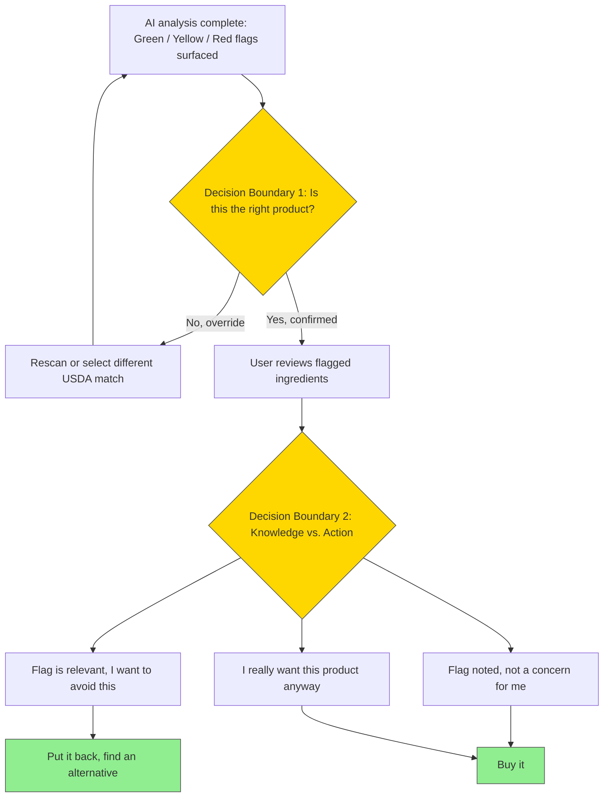

# Ingredient Assistant

A food label scanning tool for people who want to actually understand what they're eating. Built for anyone managing allergies, avoiding certain ingredients like preservatives, or just trying to make better choices at the grocery store. There is transparency about what is in your food, but that does not mean there is transparency about what it is doing there.

---

## The Problem

The idea came from something I've run into more than once. You're at the store, you pick up a product you are intriguied by, and you flip it over to check the ingredients. The list is there, and you recognize some if the basics like water and salt, but the rest might as well be written in a different language. You sort of vaguely recognize some of it, but you have no real idea what the purpose it, whether they're safe, or actively something you're trying to avoid. Ultaimtly your putting your trust into CPG companies looking out for you and your health...that's not very realistic.

Now add an actual dietary restriction into that. If you have a nut allergy, a gluten sensitivity, or you're avoiding something specific for health reasons, reading food labels becomes genuinely stressful, and missing couple words in small text could mean the differnece between a deployed epipen. The "Contains:" statement helps, but it only covers the major allergens. If there is something not one there you want to avoid, be ready to spenf the next few minutes until you give up squinting at the back of a product in the middle of the store.

That's the problem this tool is trying to solve. The Ingredient Assistant lets you point your camera at a food, beverage, or supplement product, and it tells you what's actually in it. It's plain English, describes what it is, what the purpose is, flagging anything that might be relevant to your health profile.

---

## System Diagram

Here is how the system works:

Blue nodes are AI steps. The yerllow node is where the human takes over completely.

---

## AI Workflow

Here is what is actually happening with the AI:

```mermaid
flowchart LR
    A[Step 1: Scan product front] --> B[GPT-4o Vision]
    B --> C[Step 2: USDA API search]
    C --> D[Step 3: GPT-4o selects best match]
    D --> E[Step 4: Per-ingredient analysis]
    E --> F[Cross-check allergy profile]
    F --> G[Flagged output: Green / Yellow / Red]

    style A fill:#ADD8E6,stroke:#555
    style B fill:#ADD8E6,stroke:#555
    style C fill:#ADD8E6,stroke:#555
    style D fill:#ADD8E6,stroke:#555
    style E fill:#ADD8E6,stroke:#555
    style F fill:#ADD8E6,stroke:#555
    style G fill:#ADD8E6,stroke:#555
```

The allergy profile in the sidebar carries over the whole process. You can toggle the major allergens/avoidants and add your own custom ones (cocunut, MSG, whatever applies to you).

The most important metric is accuracy for the AI, as having false postives could be life-threatening.

---

## Leverage Point

The leverage point is that this system utalizes to create the most impact is in closing the knowledge gap between a consumer's evaluation and purchase of a product while shopping. The gap is currenlty filled with trust, however mistplaced, or with time-consuming scanning + googling words you don't know how to feel. 
The Ingrdient Assistant helps create impact by allowing the consumer to have control of that step, between evaluating alternatives and the purchase decision.

That middle is where this tool is. The ingredient list does not change, the onlt thing that does is whether someone can actually understand what they are looking at before they put it in their cart.

---

## Decision Boundary

The AI's only job is flagging the information. Everything after that is up to the user. THe deicsion boundary is the step between knwoledge, and action occuring from knowledge. If the emotional appeal of the product is strong, the knowledge about the ingredients won't matter. Another smaller decision boundary is when the solution asks if it has identified the product correctly, it's up to the user to confirm. THe human in the loop is evident, as the process does not move forward without the user's permission and confirmation.

## Venture Description

This is a one-person tool meant for health-conscious and imgredient-avoiding consumers. The target user is anyone who reads food labels but struggles to actually understand them, people managing allergies, parents buying food for kids with sensitivities, and people trying to cut specific additives like artificial dyes.

The value proposition lies in the fact that you should not need a biochemistry degree or FDA job to know what you're consuming on a day-to-day. Plce your trust in something factual and wihtout agenda, which is not something most CPG companies can say. 

The key activity and AI role is identification and recall. If this was an AI-team, the roles would primarly be in identifying the producgs, and retriaving the correlated information. Pretty simple task, but one where doing it wihtout this tool would take significant time, and significant eye strain. Poeple are curious, and care anout the things that they consume, but see the cost and take the easy route. Ignorance is bliss. By using AI, consumers can get organized information quickly, and in plain english with one scan.

I beleive the expected impact would be small, but a daily ritual. Most poeple have to go grocery shopping on a consistent basis, and often times feel the pressure of wanting to choose the healthy option, or be extra aware of allergens, but aren't willing to put in the time or effort. Offering that sense of security, of control is the real impact. Poeple can know what they are consuming and why it's there.

---

## Responsible AI Reflection

The most serious risk is a false negative on an allergen. There can be a mixture of human and data error risks. Human error may be overlooking an alert (which would be hard because of the clear color coding) and the captured picture obscuring the ingredients. The data error risks would be that the USDA are innacurate/unable to be pulled or that a product was recently reformulated and the database hasn't caught up. 

I have experimented arounc with some of the biases and seen them in action already. The USDA FoodData Central database includes many brands and products, however not all. Major national brands are included, but regional products, newer products, or even specicifically Trader Joes Chocolate Cups aren't recognized. I have not encountered a more robust database than the USDA one, but that data could come from partnerships with the FDA or with the manufactuers themselves. Another potential bias is the AI's view on wether somthing is truly a health flag or not. There may be many interepreations of what is not usual, and the role of the ingrdient in the product rewuires context. Both items that are left up to the AI model's discretion introduce room for bias. 

There is definitly an over-reliance component in this venture, as it could be mistaken that the AI replaces reading the ingtedient list. Because AI is confident bout many things, it still requires some thought about if you want to consume the ingredient, health flag or not. Relying on the AI to tell you wether or not to consumer something is not the urpose, it is more to give you the tools to understand. The decision to consumer/purchasd is still meant to lie with the now more informed user.

The limitations are that the system stops at flagging. It does not know the user's full medical history beyond the simple output, and it cannot get a deeper look into vague concepts like "natural flavors" because that information is not publicly disclosed. The AI is as limited as food labeling allows it to be. The Vision AI fallback for scanning ingredient panels directly is also genuinely less reliable than a structured database match, and users should treat those results with more skepticism

The oversight A few things would need to be true before this goes anywhere near a production audience. There should be a persistent disclaimer that this is informational only and does not replace reading the label or talking to a clinician, not just a one-time onboarding screen. Ingredient analyses should surface some kind of confidence indicator so users can tell when the AI is working from limited information. USDA records used in any analysis should show a last-updated date so users can judge whether the formulation might have changed. And for anyone flagging a severe or anaphylactic allergy in their profile, there should be an explicit reminder every single time that this tool is not sufficient on its own.
