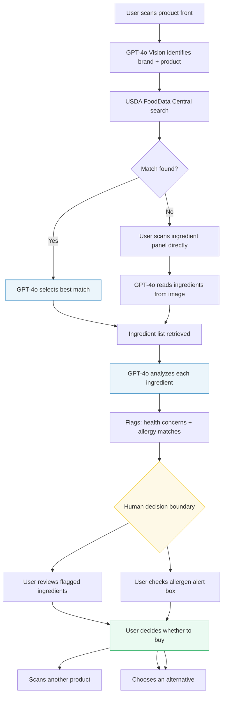
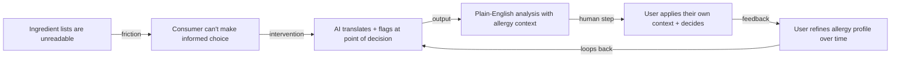
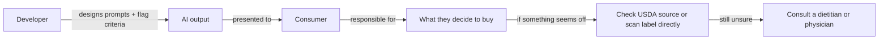

# Ingredient Assistant

> A food label scanning tool for people who want to actually understand what they're eating, built for anyone managing allergies, avoiding certain additives, or just trying to make more informed choices at the grocery store.

---

## 1. System Description

### The Problem

The idea came from something I've run into more than once. You're at the store, you pick up a product, and you flip it over to check the ingredients. The list is there - but it might as well be written in a different language. "Carrageenan." "Sodium stearoyl lactylate." "Polysorbate 80." You sort of vaguely recognize some of them, but you have no real idea whether they're fine, something to watch out for, or actively something you're trying to avoid.

Now add an actual dietary restriction into that. If you have a nut allergy, a gluten sensitivity, or you're avoiding something specific for health reasons, reading food labels becomes genuinely stressful. The "Contains:" statement helps, but it only covers the major eight allergens - and ingredient lists often have hidden sources of things people are trying to avoid, buried inside words most people can't parse.

That's the gap this tool is trying to close. The Ingredient Assistant lets you point your camera at a food product, and it tells you what's actually in it - in plain English, flagging anything that might be relevant to your health profile.

### What the AI Does

The system chains together a few different AI and data sources:

- You scan the front of a product - GPT-4o Vision looks at the image and identifies the brand, product name, and variant
- That gets used to search the USDA FoodData Central database for the official ingredient list tied to that exact product
- If the database has a match, GPT-4o picks the best one; if not, you can scan the ingredient panel directly and the AI reads it from the image
- GPT-4o then goes through every ingredient one by one: what it is, why it's in this specific product, whether there's a health flag worth knowing about, and whether it overlaps with your allergy profile

The allergy profile lives in the sidebar - you can toggle the major allergens and add your own custom ones. That context travels with every analysis.

### What Decision the Human Makes

After the analysis runs, you're looking at a list of every ingredient with a green, yellow, or red indicator. You decide:

- Whether a flagged ingredient is actually a concern for you specifically (the AI doesn't know your full medical picture)
- Whether to trust the USDA match the AI selected, or override it
- Whether to buy the product or look for an alternative
- How much weight to give the AI's "health flag" on an ingredient - those are real flags, but context matters

### Who Is Accountable

| Who | What they control | Accountable for |
|---|---|---|
| The user | Which allergies to flag, whether to trust the output, the final purchase decision | Any health-related choices made based on the analysis |
| The developer (me) | Prompt wording, the analysis criteria, how flags are triggered | Whether the AI gives useful, appropriately cautious output |
| OpenAI / GPT-4o | Product identification, ingredient extraction, per-ingredient analysis | Any hallucinated ingredient descriptions or missed flags |
| USDA FoodData Central | The official ingredient data for branded products | Accuracy and completeness of the database |
| The food manufacturer | What actually goes on the label | Whether the ingredient list reflects what's in the product |

---

## 2. System & Workflow Diagrams

Here's how the pieces connect - and where the AI hands off to the human.



The yellow box is the decision boundary - where the AI's job ends and the user's judgment begins. Blue boxes are AI steps. The green box is where the human is fully in control.

**Leverage points in the system:**



The leverage point isn't the ingredient list itself - it's the translation layer between the label and the decision. That's where this tool intervenes.

**Accountability flow:**



---

## 3. Working Prototype

The prototype is a Streamlit app. It's functional and I've used it on real products, but it's definitely still a prototype - the USDA database has gaps, and the UI has rough edges I'd smooth out before putting this in front of anyone else.

### How to run it

Install dependencies:

```bash
pip install streamlit openai pillow python-dotenv requests
```

Add your API keys to a `.env` file:

```
OPENAI_API_KEY=your-key-here
FDC_API_KEY=your-usda-key-here
```

You can get a free USDA FoodData Central API key at [fdc.nal.usda.gov](https://fdc.nal.usda.gov/api-guide.html).

Run the app:

```bash
streamlit run app.py
```

### What it does

- **Sidebar:** Toggle your allergy profile - nine common allergens plus a custom field for anything else (sulfites, carmine, MSG, etc.). Your profile saves between sessions.
- **Step 1:** Open your camera or upload a photo of the product front. GPT-4o Vision identifies the product.
- **Step 2:** Confirm the product match. If it looks right, the app searches USDA for the ingredient list.
- **Step 3:** If a confident USDA match is found, it auto-selects it. If it's uncertain, it shows you candidates and lets you pick. If nothing matches, you scan the ingredient panel directly.
- **Step 4:** Every ingredient gets analyzed. Green means clear, yellow means worth knowing, red means allergy concern. Click any ingredient to expand the full explanation. An alert box at the top surfaces anything in the "Contains:" statement that matches your profile.

---

## 4. Decision Walkthrough

### Scenario: Buying a snack bar while managing a tree nut allergy

Here's the situation I had in mind while building this. I'm at the grocery store looking at a protein bar. I have a tree nut allergy - not severe, but real enough that I want to be careful. The "Contains:" statement on the back says "Milk, Soy." Looks fine. But I want to check what else is in there before buying it.

I open the app, scan the front, and confirm the product match. The USDA finds the right one. The analysis runs.

**What the AI returned:**

The "Contains" box comes back clean for my profile - no tree nut call-out. But when I scroll through the ingredients, one comes back flagged in yellow:

> **Natural Flavors**
> → What it is: A broad FDA category that can include compounds derived from many plant and animal sources.
> → Purpose in this product: Adds taste complexity without disclosing the specific source ingredients.
> → Health flag: "Natural flavors" is a catch-all term - the actual source compounds are not disclosed on labels. For people with specific sensitivities, this is a known gray area.

And another one in red:

> **Almond Flour** 🚨
> → What it is: Flour ground from blanched almonds, a tree nut.
> → Allergy alert: Almonds are a tree nut. This ingredient directly conflicts with your tree nut allergy profile.

The "Contains:" statement missed it because the manufacturer listed almond flour as a main ingredient, not in the allergen declaration. The AI caught it.

### Human interpretation

This is exactly why I built this. The official label technically listed everything - but the "Contains:" shortcut that most people rely on didn't surface the almond flour as a tree nut. I wouldn't have caught that by quickly scanning the label.

That said, I still cross-checked the USDA ingredient list directly (visible in the status bar during the analysis step) to make sure the app had the right product. It did.

### The final decision

I put the bar back. The call was mine - the AI just made sure I had the full picture before making it. If I hadn't been running the app, I probably would have bought it based on the "Contains" statement alone.

### The appeal / override path

If I'd been skeptical of the USDA match - like if the product description looked like a different size or formulation - I could have overridden it and scanned the ingredient panel on the back directly. The app supports both paths. The direct image scan is slower (Vision AI reading small print isn't always perfect), but it's there as a fallback for exactly that reason.

---

## 5. Reflection

### Where does the system intentionally stop?

The system stops at flagging. It does not tell you whether you will have a reaction, how serious a health flag is for your specific situation, or whether any ingredient is safe for you medically. Those decisions require a clinician, not an app.

It also stops at the USDA database boundary. If a product isn't in the database - which happens more often than I'd like, especially for store brands and newer products - the system falls back to Vision AI reading the label. That's less reliable than a structured database record, and the user should treat it with a bit more skepticism.

### What risks remain?

- **False negatives on allergens are genuinely dangerous:** If the AI misses an ingredient because it's obscured in a photo, or because the USDA record is incomplete, that's not just an inconvenience. For someone with a serious allergy, this could cause real harm. The system should be treated as a supplement to label reading, not a replacement.
- **The AI sounds confident even when it isn't:** GPT-4o writes fluent, authoritative-sounding explanations. An ingredient it knows little about gets the same confident sentence structure as one it knows a lot about. I'd want a better signal for uncertainty in future versions.
- **USDA database coverage gaps:** The database is strong for major branded products but has real holes - especially for regional brands, restaurant-packaged items, and anything recently reformulated. An outdated record could give you a stale ingredient list.
- **"Natural flavors" and similar umbrella terms:** The AI flags these correctly as gray areas, but it can't tell you what's actually inside them. No AI can - it's not disclosed publicly. This is a systemic limitation of how food labeling works, not something the tool can solve.

### How could misuse occur?

- Someone with a severe allergy treats this as a medical-grade safety check and skips reading the label themselves
- A user interprets a green result as a guarantee of safety, rather than as "no known concerns based on available data"
- Someone uses it to build false confidence in a dietary claim they want to make ("the AI said it's fine")

### What would governance look like at scale?

If this became a real consumer product, I think responsible governance would need to include:

- **Explicit disclaimer at first launch:** this tool is informational, not medical advice, and does not replace label reading or clinical guidance
- **Confidence indicators on ingredient analysis:** some way to surface when the AI is working from limited information
- **Version tracking on USDA data:** flagging when the database record used was last updated, so users can judge whether the formulation might have changed
- **Escalation path for severe allergies:** a clear prompt that says "if your allergy is anaphylactic, do not rely on this tool alone" - every time, not just once

### Venture concept

This is a one-person consumer tool. The target user is anyone who reads food labels but struggles to actually understand them - people managing allergies, parents buying food for kids with sensitivities, people trying to cut specific additives like artificial dyes or emulsifiers. The value proposition is simple: you shouldn't need a biochemistry degree to know what you're putting in your body.

The AI makes this viable as a one-person venture because the core work - identifying products, pulling ingredient data, explaining ingredients in plain English - would have required a large team and a proprietary database to do manually. Instead, it's three API calls and a well-designed prompt. That's what AI changes economically: the cost of producing that kind of intelligence at scale drops dramatically.

A freemium model makes sense - basic scans free, unlimited scans and deeper analysis (nutrition context, historical reformulation flags, cross-product comparison) on a low-cost subscription. The key activity is prompt quality and product match accuracy. The expected impact is small but real: fewer people getting surprised by ingredients they were trying to avoid.
